Diagnostic quick start guide
============================

Introduction
------------

Your organization processes sensitive data every day. As a manager, you
have an obligation to establish specific security procedures
(behavioral, organizational and technical) to protect this data.
Moreover, these procedures must address the fundamental principles of
necessity and proportionality. Identifying the best measures and
defining the level of effectiveness required for each measure is a
highly complex task. The CASES Diagnostic supports you in this process.

**HOW?**  
Using the dedicated questionnaire, this tool will help you :

+ Identify vulnerabilities
+ Evaluate the security level of information systems
+ Issue recommendations

### Other documents

Here would you find further Diagnostic related documentation :
* [**Technical guide**](documentation/technicalguide): Components installation walkthrough and troubleshoot section
* [**User guide**](documentation/userguide): Complete Diagnostic available functionalities documentation

Quick start
-----------

-   Download [**VM\_Diagnostic.ova**](https://github.com/CASES-LU/diagnostic/releases/tag/1.0) ready-to-use virtual machine file which can be imported directly into a virtualization tool

-   Make use of the **installation scripts** provided in the [**Diagnostic repository**](https://github.com/CASES-LU/diagnostic/tree/master/scripts)

### Using the Virtual Machine

The aforementioned virtual machine has already been setup and
provisioned with all application component in an Ubuntu Server 17.04
environment.

You can then import **VM\_Diagnostic.ova** file in a virtualization tool
which in our case will be VirtualBox.

#### Virtual machine import

**( File → Import Appliance )**

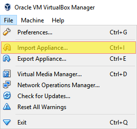

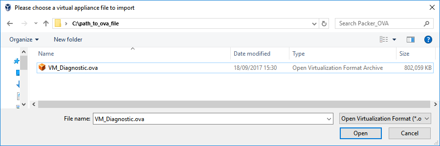

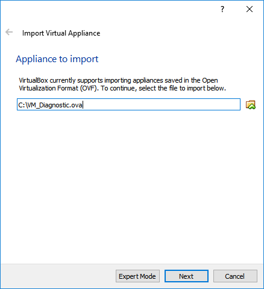

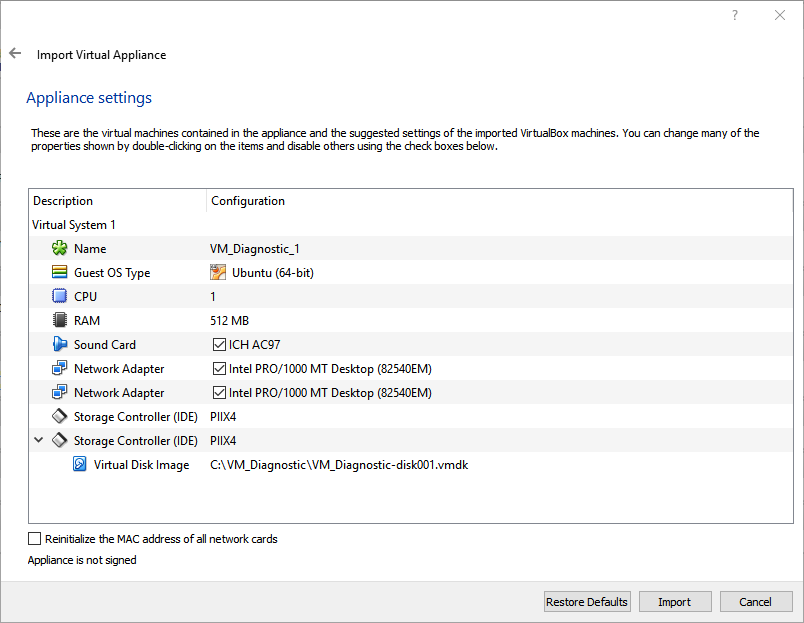

#### VirtualBox configuration

When successfully imported the virtual machine, you now need to setup a
Host Only Network Adapter for it in VirtualBox

**( File → Preferences → Network )**

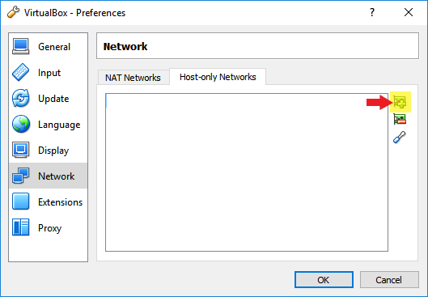

And configure it like the following

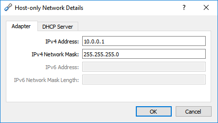

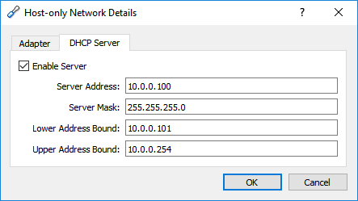

Click OK and you should see it in the list

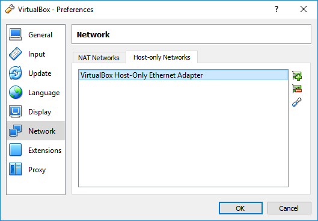

Then you have to tell VirtualBox that the machine you just imported have
to use the Host Only Network Adapter

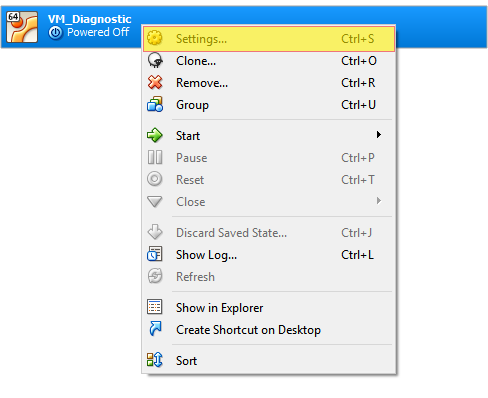

Go to Network tab

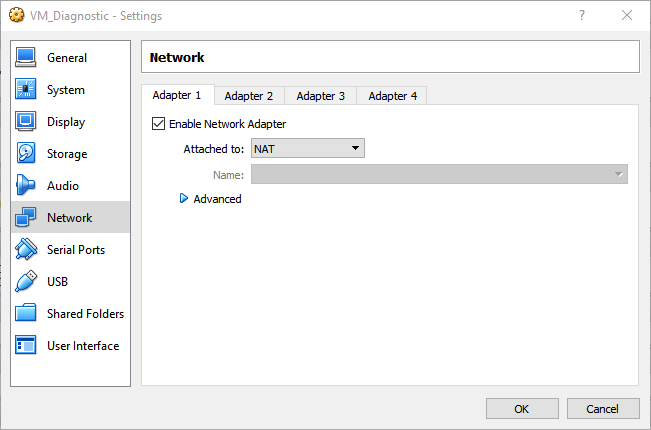

And select Adapter 2 and fill like the following

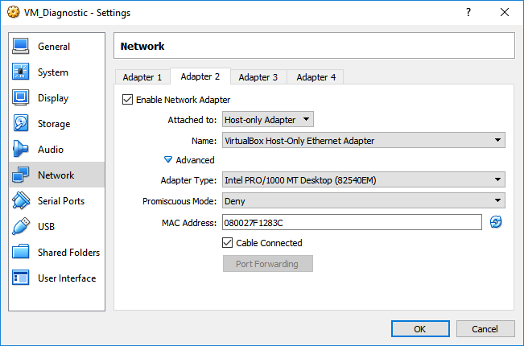

Make sure everything is correctly set

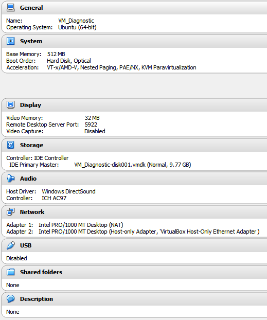

And run the virtual machine. You know you are good to go when seeing
that screen:

#### Access your Diagnostic application

Open your favorite browser and type in: <http://10.0.0.102>

#### Default machine credentials

* Diagnostic application: (<diagnostic@cases.lu>:Diagnostic1!)

* Virtual machine user: (diagnostic:diagnostic)

* Mysql root user: (root:GENERATEDPASSWORD)

* Mysql diagnostic user: (diagnostic:GENERATEDPASSWORD)

### Using the installation scripts

In case you want to install the Diagnostic application on a Ubuntu or
Debian distribution you may use the provided installation scripts.

Simply run the following commands

    git clone gitrepo.git
    cd repository
    ./install.sh

Provide the script the information it needs when it asks (e.g mysql
user:password )

You are good to go then !

Changelogs
==========

CHANGE LOG VERSION 1.1 JUNE 2018

- Update Ubuntu from 17.04 to 18.04.
- Update Php from 7.0 to 7.1.
- Add color to the category in the report (radar chart and tabs).
- Update the Diagnostic's logo from CASES to DIAGNOSTIC.
- Modify report to be more visual.
- Update calculation method (no more Planned Maturity, there is now a Non Applicable button).
- Display red points instead of triangles in the diagnostic to match with the MONARC convention.
- Use of OpenSSL to export and upload new diagnosis which wasn't working anymore since Php7.1.
- Add category tab in the adminitration mode. It is now possible to add/modify/delete new categories for the >Diagnostic.
- Update the administration mode. It is now possible to translate questions and categories without getting in >the .po files.
- Update documentation to match with new features.

CHANGE LOG VERSION 1.2 AUGUST 2018

- Add language tab in the administration mode. It is now possible to add/modify/delete new languages and new translations.
- Add confirmation before deleting something(questions, categories, languages, translations).
- Add Reports tab in the administration mode in which we can download/upload report template modals.
- Add Settings tab in the administration mode in which we can change some global settings and add diagnostic statistics.
- Add importation/exportation for questions, categories and translations.
- Add an Uid for the Diagnostic, for the questions and for the categories.
- Add statistics importation for a diagnosis.
- Add several information in a diagnosis. We can now choose the activity of the company and its number of employees.
- Change the threshold calcul method for each question. It is now equal to threat*weight depends on the question.
- Add blocking question. Used if an essential domain for the entity is not managed.
- Update the evolution of maturity bar chart. We can now see the average of diagnoses of the current domain and overall diagnoses done for a year given.
- Add an help part for the organization and synthesis parts in a diagnosis.
- Aesthetics and ergonomics improved in the report. Better colors, N/A displayed instead of 0% out of 0%.
- Translation files now divided between questions, categories and translations for more visibility.
- Update documentation to match with new features.

Diagnostic - Cases
==================

Copyright (c) 2017, Benjamin Joly, Jerome Lombardi, Fabien Mathey, Juan Rocha - securitymadein.lu - Smile GIE

Copyright (c) 2017, Yacine Khamis - Université de Lorraine

Copyright (c) 2017, Jérôme De Almeida - Vesperia Group

Copyright (c) 2018, Romain Desjardins - Université de Lorraine

Licensed under Affero GNU GPL v3 - see license.txt for more information
