First connexion and Password change
===================================

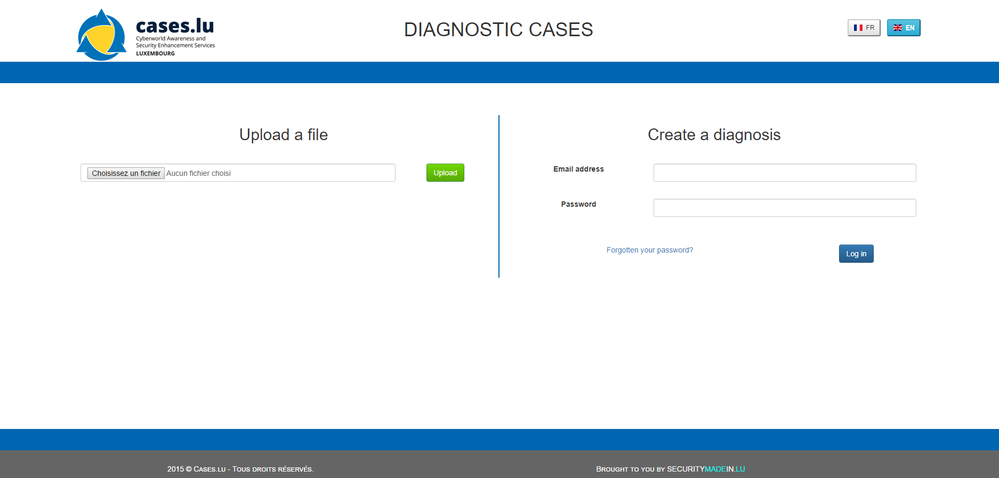

The first step to do is to change the password. For that, just click on
the ‘Forgotten your Password?’ link, and put the mail which should be on
the database.

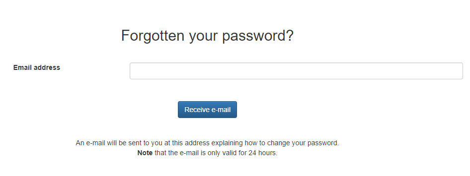

Then mail will be sent to you.

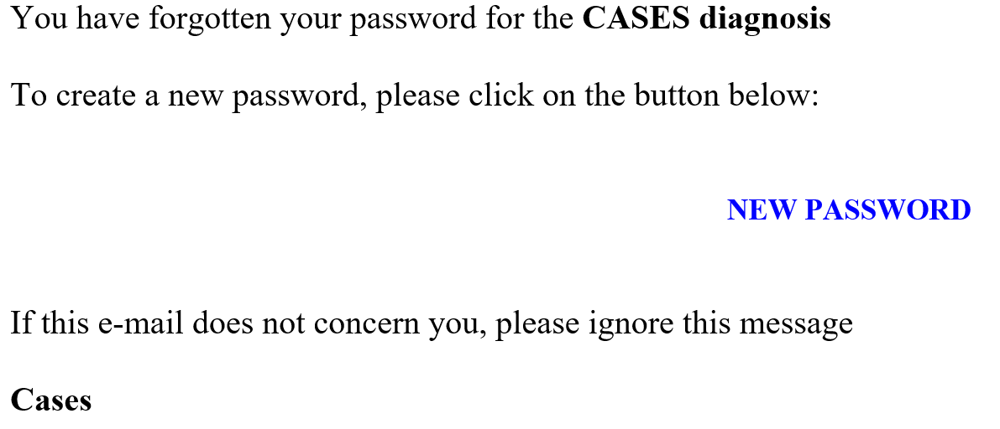

By clicking the link ‘NEW PASSWORD’ in the mail, you will get into a
page where you can change your password. You only need to put the new
one into the two text fields, and then just click on the ‘Change
Password’ button. If the mailing address is not found on the database,
the mail will not be sent.

Then, you just need to create your first own diagnosis. For that, just
log in to the main connexion screen, by giving your mail and your new
password. Then, just click on the ‘Log in’ button.

> **Warning**
>
> If you are on the Virtual Machine, you will NOT have any mail server
> installed by default. So you wont receive any mail unless you install
> one. You can also use a script included in the virtual machine to
> change manually a password of any user [\[*Path\_to\_Diagnostic*\]/scripts/changePassword.sh](../../scripts/changePassword.sh)

> **Tip**
>
> This script should be used only in a closed environment which does not
> have a network connexion. This script needs to have the username of the
> user that wants to change his password. (Ex: `./changePassword.sh "diagnostic@cases.lu"`).
> The password needs to have at least a lower case, an upper case, a digit
> and a special char, and at least 8 characters.  

Begin a Diagnosis as a User
============================

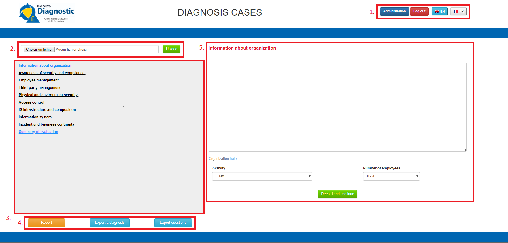

On the header, at the right side (**1.** on the picture), you can set,
by clicking on the corresponding button, your language (**French** and
**English** are the two only choice right now). You can also disconnect
by clicking on the ‘Log out’ button. Also, if you are administrator of
the application, you should see the admin menu access button near the
red button use to disconnect.

On the top of the screen but below the header, at left, you could see a
button where you could just resume form an old diagnosis (**2.** on the
picture).

Just below, you have the navigation panel (**3.** on the picture), which
we will describe just a little later. Same for the two buttons used to
get the report or save the current Diagnosis (**4.** on the picture).

Finally, on the right of the screen, you have a free-text panel, where
you should put some text which will be in the report (**5.** on the
picture). Most of the time, the introduction is used to give the context
of this diagnosis, and some info that could be useful when you read the
report.

Then, to save your work, you should just hit ‘Record and continue’. In
the navigation panel, the theme should be green to indicate that there
is already some text.

The summary, which is the last part of the Diagnosis, is a short
description of the most important points in it. The most important
recommendations, what should be done next…

Those are the only free text fields which are present.

After saving the first information, you will be redirected to the first
question.

As you can see in the navigation panel, there are eight big themes,
which can contain some questions. The red color is mainly used on the
theme where you currently are. The question which is black and bold is
the current one. The green one is saved and contains text. By clicking
on the main theme, question about it will appear, and then you can go on
the questions by clicking on them.

The red cross near the question is to delete the question for this
diagnosis.

> **Warning**
>
> If you make a new one, the question will appear again. If you want
> to make it disappear for all diagnosis that you make, you should just
> go in the administration panel to delete it.

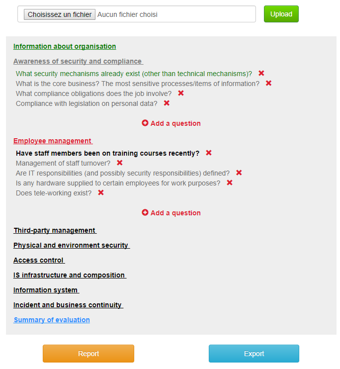

You can also add questions by clicking the red  button.

> **Warning**
>
> Be careful, when you do add a question this way, it will be only last
> during this diagnosis. If you want to add a question for all your
> diagnosis, you should add it in the administration part.

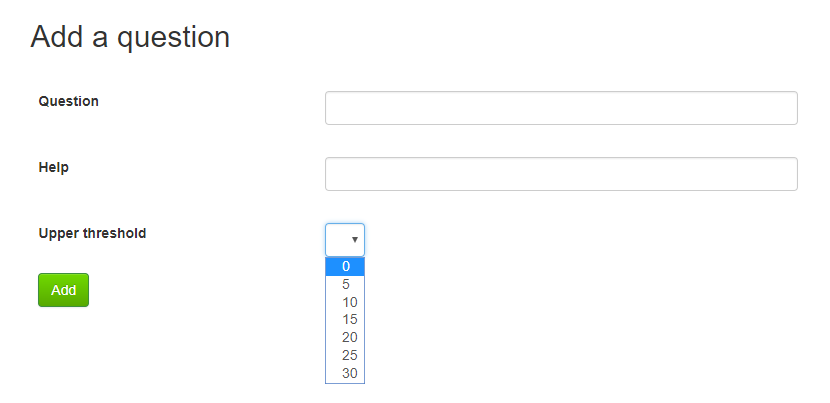

You will have the question field to add the question as it will appear
into the report. The info field is for details which are displayed only
for the question creator. It’s useful to add details to the question, or
have a reminder of the main points to talk about.

The threshold is a little more difficult to use. To put it simply, this
is the weight in the category of the question.

Let’s take an example:

Imagine you need a specific question on the BYOD, and you think this
should be really important. You have, in the same category, a question
less important.

If the threshold are respectively 10 and 5, then the maturity 
on a level is calculated this way: ((10/3 x maturity) + (5/3 x maturity)) 
where the maturity could be 0 if not managed, 1 if more or less managed
and 2 if managed. So if a policy is more or less managed about BYOD and
the other question is managed, the category will be ((15/3 x 1) + (10/3 x 2))
= 5 + 6 = 11 out of 16 (The maximal possible) of maturity for this category.

> **Tip**
>
> The maturity can also be not applicable, i.e. the question is not appropriate
> for the enterprise. Thereby, the question is not calculated in the final result.

Finally, just hit the green ‘Add’ button to add your new question and
get back on the main page.

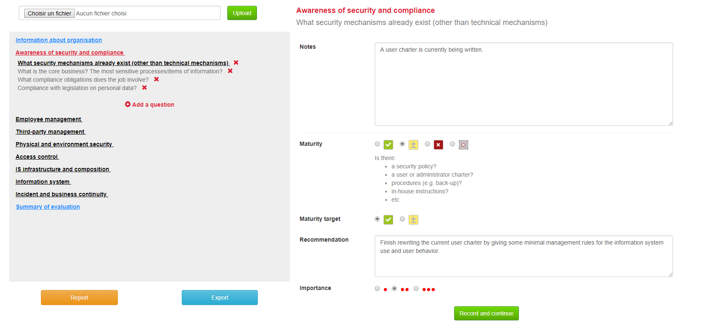

On the right side, you have a text field ‘Note’ where you can put what
you have seen, what has been said during the interview, precision about
what you want…

The maturity panel is where you can set the current maturity on a scale
of four levels (managed, more or less managed, not managed and not applicable).
You will also have some reminders to think when you ask the question,
what you should have in mind when you asking it, and what kind of answer you
should have.

The maturity target panel is the maturity level that the company should
have. It’s not necessarily managed, so the information security could be
adapted from a company to another.

The recommendation panel is the place where you could just put what the
company should do to have a better information security.

Finally, the gravity panel is to determine how much the recommendation
should be quickly implemented. For saving, as before, just hit ‘Record
and continue’.

Administration Panel
====================

User Tab
--------

You have two tabs (On the blue header), the first one is for Users, and
the second one is about the Questions.

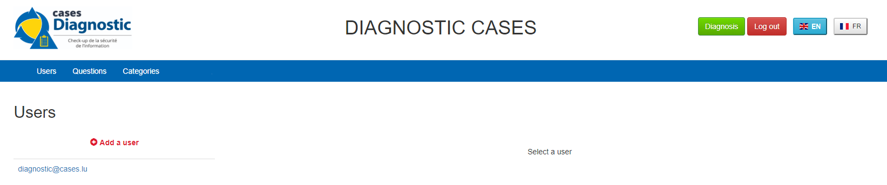

You can see all the mail addresses which are authorized to connect to
the diagnosis. You can click on the  button, so you can add a user.

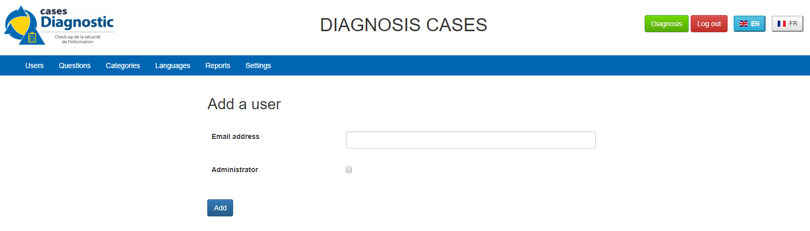

You can put a mail address, choose if this account has access to this
interface, and just add it by clicking the blue button ‘Add’.

On the page where you can see all mail which is allowed to connect to
the Diagnosis, if you click on them, you should be able to modify the
address or choose whether it is admin or not.

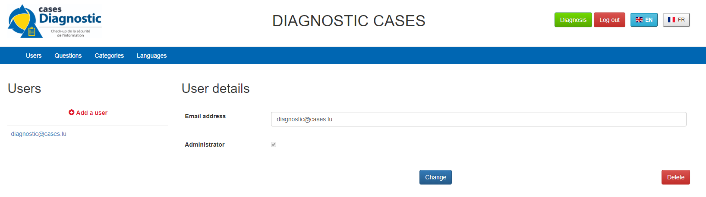

> **Tip**
>
> The only way to modify a password is to get a password Forgotten link,
> or the script which is with the Virtual Machine.

You can also delete an user by clicking on the right side, the red
button where "Delete" is written.

> **Warning**
>
> Be extremely careful, there is no confirmation message when you delete
> a user here.

Questions Tab
-------------

### Question Screen

The second tab list all the default questions that will appear when you
open a new Diagnosis.

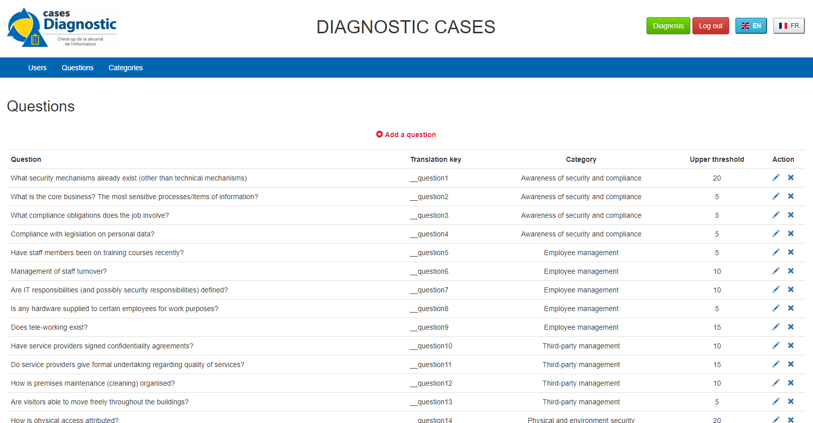

In the ‘Question’ column, you have all the questions that will appear.
The translation key is mainly used to link questions through all
languages. The category is, of course, the main theme linked, and the
threshold could be assimilated to the maturity that will bring a managed
control. To finish, the ‘action’ column represents the possibility to
edit the question (by clicking the pen
()) or delete it (by clicking the cross
()).

### Add a Question

You can also add questions by clicking the red  button.

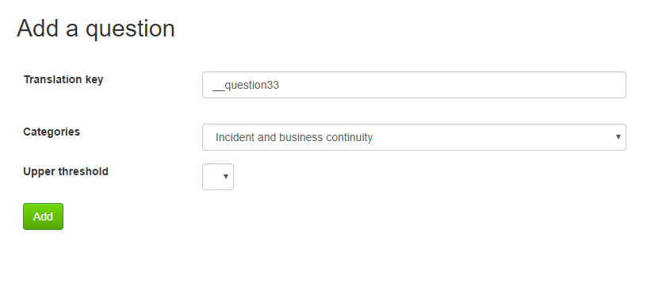

The first field is for the translation key used by the PO file. The
built-in question is done by giving two underscores, the tag "question"
and the number of the questions (For example, "\_\_question33").

Then you have some fields in which you can translate your question
and its help.

> **Tip**
>
> If you do not put translations, the name of the question will
> be the key you wrote above. You can choose to translate in one language
> and not in the others. Writing some help is optional, it depends
> on your needs.

You can also choose the category of the question, and its upper
threshold as if you were adding a question which is not definitive.

Then, you will find the question in every diagnosis you will do.

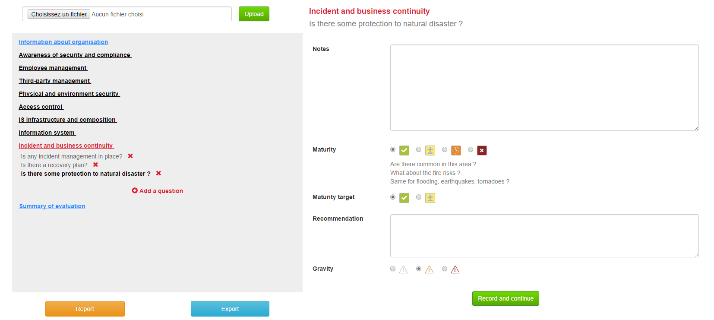

### Change a Question

By editing, you will get on a similar interface as if you were adding a
question. You can change details on the same ways.

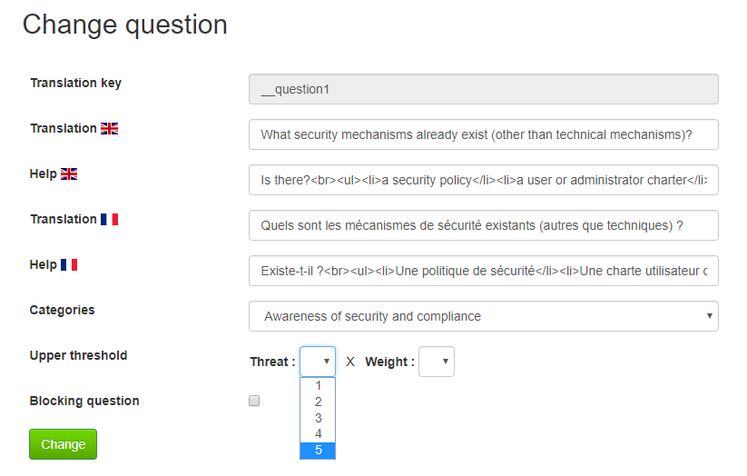

### Delete a Question

Just click on the blue cross () to
definitly delete the question, with a confirmation message.

Categories Tab
-------------

### Categories Screen

The second tab list all the default categories that will appear when you
open a new Diagnosis.

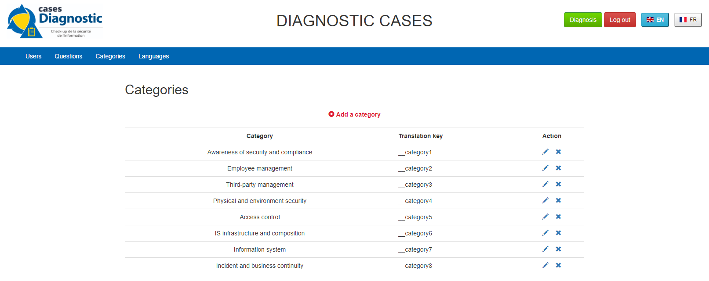

In the ‘Category’ column, you have all the categories that will appear.
The translation key is mainly used to link categories through all languages.
To finish, the ‘action’ column represents the possibility to edit
the category (by clicking the pen ())
or delete it (by clicking the cross ()).

### Add a category

You can also add categories by clicking the red  button.

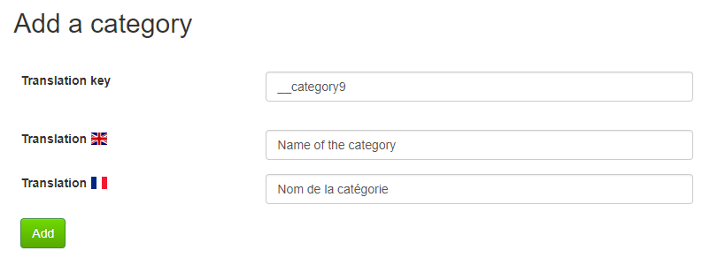

The first field is for the translation key used by the PO file.
The built-in category is done by giving two underscores, the tag "category"
and the number of the category (For example, "\_\_category9").

Then you have some fields in which you can translate your category.

> **Tip**
>
> If you do not put translations, the name of the category will be the
> key you wrote above. You can choose to translate in one language
> and not in the others.

Then, when you add your category, you will find it in every diagnosis
you will do, as long as it contains at least one question.

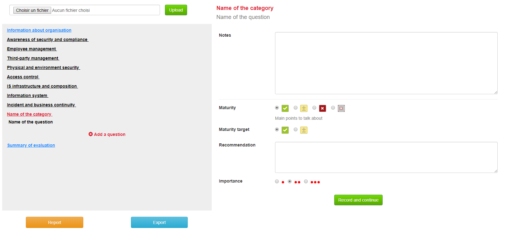

### Change a Category

By editing, you will get on a similar interface as if you were adding
a category. You can change details on the same ways.

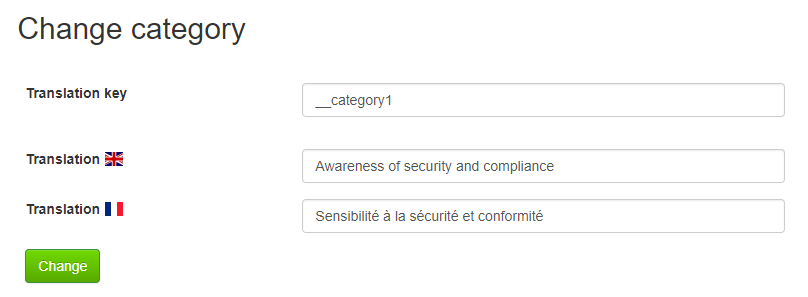

### Delete a category

Just click on the blue cross ()
to definitely delete the category, with a confirmation message.

Resume or finish a Diagnosis
=============================

Before your session ends for security reason, or if you want to resume
your diagnosis later, it is recommended to export often your work, by
hitting the yellow button below the navigation panel.

Files are renamed by the following name: data\_yyyymmddhhnnss.cases
where

-   y = year

-   m = month

-   d = day

-   h = hour

-   n = minutes

-   s = second.

There are two ways to load this diagnosis. The first one, at the
connexion screen, doesn’t need to have an account to go on it.

By doing this, you will have only access to the report this way. It is
mostly used to have another quick way to show an overview of the report.
The other way is on the main page that you access just after getting
connected.

Just on the top of the navigation panel, you can load the file that you
have downloaded, or that someone gives to you to resume or modify the
Diagnosis.

Report
======

Online Report
-------------

You can access to the screen report by just clicking on the yellow
button . You can also get this
screen without being connected, but you will not be able to download the
report as a ‘.docx’.

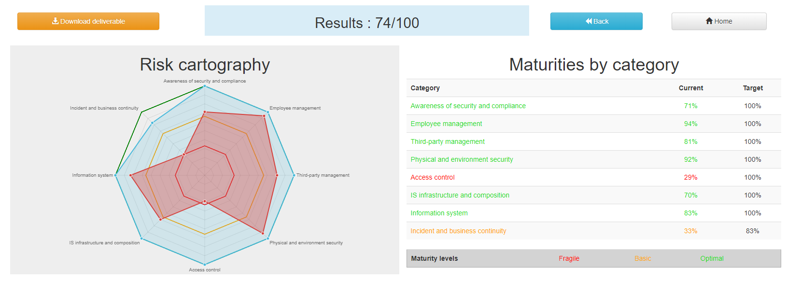

The first graph that you can see is the maturity by domains with the risk
cartography and more precisely with the tab on the right. The colors determine
the level of maturity of each category (red when maturity is under 33%, orange
between 33% and 66% and green over 66%). You will also find the recommendation
tab which briefly summarizes the recommendations, their gravity and their
current and target maturity.

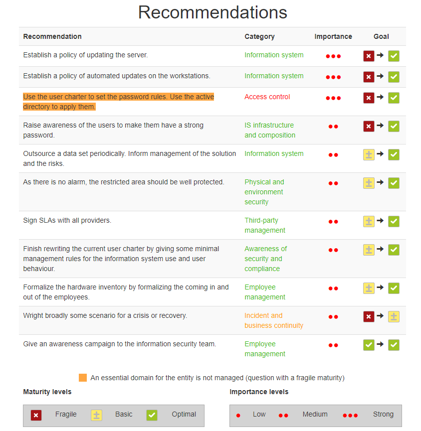

Just below the first tab, you will find the current maturity level and
the target level.

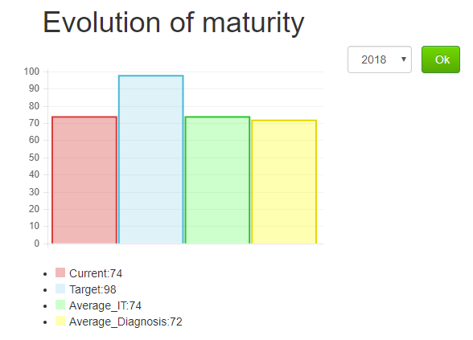

And you will also find the proportion of the category on the whole
Diagnosis.

Offline Report
--------------

If everything seems okay, you just need to get it on a .docx, and for
that, click on the yellow button ‘Download deliverable.’

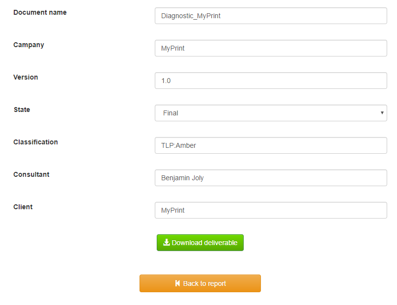

You will need to put a Document Name, the company which concerned by the
Diagnosis, the version of the document (If there are multiple
Diagnoses, or if you want to correct it…), a choice if it’s a draft or
a final version of the Diagnosis, the classification of the document
(who can read it or have it, it’s a free text, so it can be chosen with
TLP, or a classification on your own), and finally the name of the
consultant and the name of the client. Most of that data will be found
on the document. The document will be named \[*Document
Name*\]\_Date.docx.

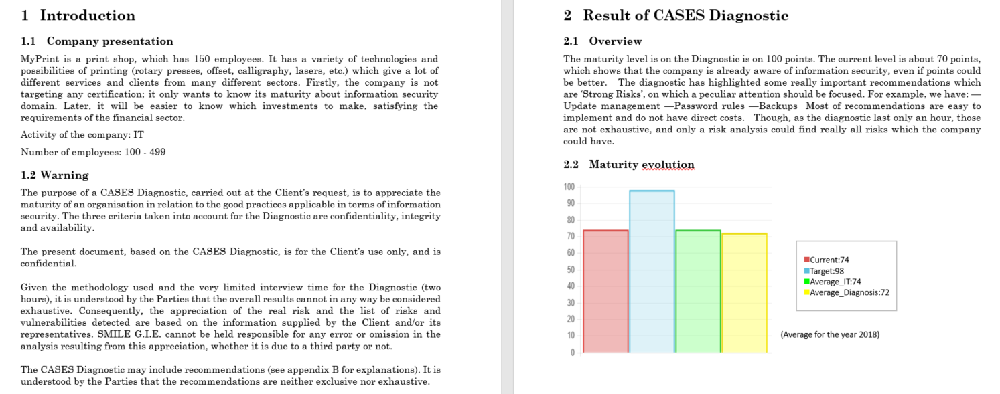

In the document, you can find on the Part 1.1 the free text in
‘Information about organization’ and on 2.1 the free text in ‘Summary of
evaluation’.

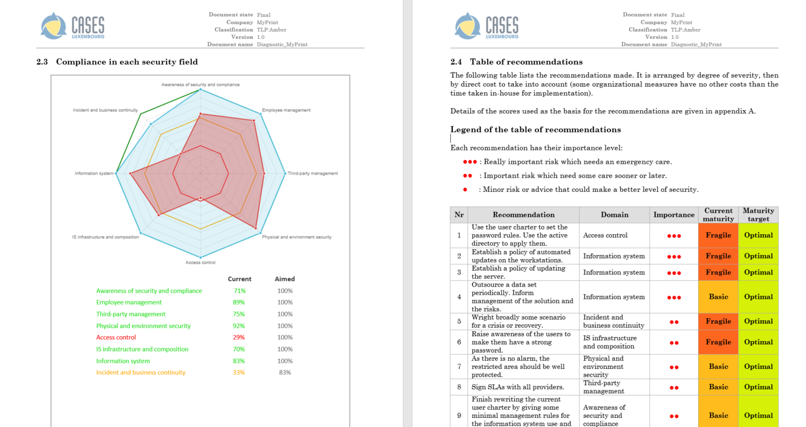

Graphics and tabs which were on the report screen could mostly be found
on in the document. a .docx

There is also a tab which contains the questions, the note taken, the
recommendation and the current and target maturity.

Modify the template report
--------------------------

The template report is quite simple to understand. It can be found in :
\[*PATH\_TO\_DIAGNOSTIC*\]/data/resources. There is some tags which
corresponding to some fields in the diagnosis. You can find a complete
list just below. Concerning the charts, some dummy pictures are in the
document. Their name are "*image9.png*", "*image5.png*" and
"*image10.png*".

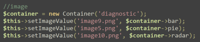

And here is the dummy for the pie chart :

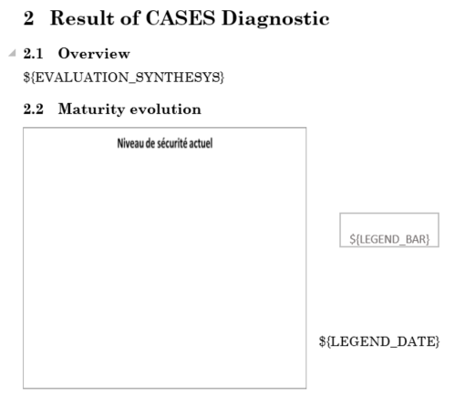

As you can also see, tags which can be modified in their order, or that could be just delete are under the form "${TAGS}". A complete list of the different existing tags can be found just below.

* \$\{CATEG\_\_PERCENT} : The current percentage got in the categories (Got automatically)
* \$\{CATEG\_\_PERCENT\_TARG} : The aimed percentage got in the categories (Got automatically)
* \$\{CLASSIFICATION} : Indication to know where and how the document could be spread (Field got just before download the report)
* \$\{CLIENT} : Name of the person who represents the company which has been the subject of the diagnosis (Field got just before download the report)
* \$\{COMPANY} : Name of the company which has been the subject of the diagnosis (Field got just before download the report)
* \$\{CONSULTANT} : Name of the security consultant or the company which has done the Diagnosis (Field got just before download the report)
* \$\{DATE} : The date when is generated the report (Done automatically, depending of the server date)
* \$\{DOCUMENT} : Name of the document (Field got just before download the report)
* \$\{EVALUATION\_SYNTHESYS} : Some important conclusions of the diagnosis, or important information to underline (Field got on the last free-text field, "Summary of evaluation")
* \$\{LEGEND\_PIE} : The legend of the pie chart which contains all the categories (Got automatically)
* \$\{NOTES\_TABLE} : The table which contains all the notes, maturity, recommendation of each questions (Got automatically)
* \$\{ORGANIZATION\_INFORMATION} : Some information that are general on the company (Field got on the first free-text field, "Information about organization")
* \$\{PRISE\_NOTE_CATEG} : The name of the categories/securities domain field (Got automatically)
* \$\{RECOMMENDATION\_TABLE} : The recommendation table (Got automatically)
* \$\{STATE} : State of the document, to know if it's still a draft, or a final version (Field got just before download the report)
* \$\{TYPE} : State of the document, to know if it's still a draft, or a final version (Field got just before download the report, other font text)
* \$\{VERSION} : Versioning of the document (Field got just before download the report)
